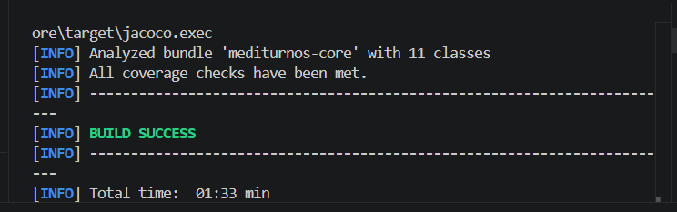

# MediTurnos - Core Domain

MediTurnos es un sistema de agendamiento de turnos medicos. Este repositorio contiene
el **Core de Entidades de Dominio Puro**, completamente aislado de frameworks, bases de
datos o interfaces externas, siguiendo los principios de Clean Architecture / Arquitectura Hexagonal.

## Glosario tecnico

| Termino (dominio) | Clase                | Descripcion                                              |
|--------------------|-----------------------|-----------------------------------------------------------|
| Paciente           | `Paciente`            | Persona que solicita un turno medico.                     |
| Medico             | `Medico`               | Profesional que atiende el turno, con capacidad diaria.   |
| Turno               | `Turno`                 | Reserva entre un paciente y un medico en una fecha/hora.  |
| Estado del turno    | `EstadoTurno`           | PENDIENTE, CONFIRMADO, CANCELADO.                          |
| Agendador           | `AgendadorTurnos`       | Caso de uso: agenda, confirma y cancela turnos.            |
| Agenda medica        | `AgendaMedica` (puerto) | Consulta disponibilidad y carga diaria de un medico.       |
| Notificador          | `NotificadorTurno` (puerto) | Notifica confirmaciones/cancelaciones (SMS, email, etc). |

## Arquitectura

- **Java puro**: sin Spring, JPA ni anotaciones web. El dominio solo depende de si mismo.
- **Inversion de dependencias**: toda interaccion externa se modela como interfaz
  (`AgendaMedica`, `NotificadorTurno`) e inyectada por constructor en `AgendadorTurnos`.
- **Reloj inyectable (`Clock`)**: evita depender de `LocalDateTime.now()` directamente,
  haciendo que las reglas de fecha sean deterministas y testeables.
- **Excepciones de negocio propias**: `TurnoInvalidoException`, `MedicoNoDisponibleException`,
  `CapacidadExcedidaException` y `TurnoYaCanceladoException`, todas heredando de
  `MediTurnosException`.

```
src/main/java/cl/lmb/mediturnos
├── domain      -> Paciente, Medico, Turno, Especialidad, EstadoTurno
├── exception   -> Excepciones de negocio personalizadas
├── port        -> Interfaces (puertos) hacia el mundo exterior
└── service     -> AgendadorTurnos (caso de uso principal)
```

## Testing y calidad

Este proyecto usa **JUnit 5** y **Mockito** para asegurar los mas altos estandares de calidad.

- **Patron AAA riguroso**: todos los tests estan estructurados en fases
  Arrange / Act / Assert claramente comentadas.
- **Excepciones de negocio**: verificadas exhaustivamente con `assertThrows`.
- **Dobles de prueba**: `AgendaMedica` y `NotificadorTurno` se mockean con `@Mock` y se
  inyectan por constructor en `AgendadorTurnos`, aislando el caso de uso de cualquier
  infraestructura real.
- **Cobertura 100%**: la suite garantiza 100% de cobertura de lineas y de ramas
  (Line/Branch Coverage), sin caminos logicos huerfanos.

## Como verificar

Para correr los tests y generar el reporte de cobertura JaCoCo:

```bash
mvn clean verify
```

Esto ejecuta los tests, genera el reporte y **falla el build** si la cobertura de lineas
o ramas cae por debajo del 100% (regla configurada en `pom.xml`).

Para generar solo el reporte HTML sin la validacion estricta:

```bash
mvn clean test jacoco:report
```

Luego abre el reporte en: `target/site/jacoco/index.html`

## Autor

Luis Madrid B. — [github.com/Luismadridb](https://github.com/Luismadridb)

## Cobertura de tests

