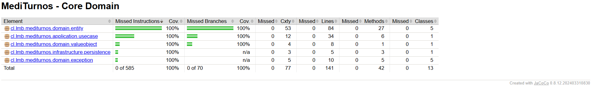

- **Regla de dependencia estricta**: `domain` no conoce a `application` ni a `infrastructure`.
- **Value Objects auto-validantes**: `Rut` es un `record` que valida formato en su constructor compacto.
- **Inyeccion por constructor**: `AgendadorTurnos` recibe `AgendaMedica`, `NotificadorTurno`
  y `TurnoRepository` como interfaces, nunca instancia sus implementaciones con `new`.
- **Reloj inyectable (`Clock`)**: evita depender de `LocalDateTime.now()` directamente.

## Glosario tecnico

| Termino (dominio) | Clase                       | Descripcion                                              |
| ----------------- | ---------------------------- | -------------------------------------------------------- |
| Paciente          | `Paciente`                   | Persona que solicita un turno medico.                    |
| Medico            | `Medico`                     | Profesional que atiende el turno, con capacidad diaria.  |
| Turno             | `Turno`                      | Reserva entre un paciente y un medico en una fecha/hora. |
| Rut               | `Rut`                        | Value Object que valida y normaliza el formato del rut.  |
| Repositorio       | `TurnoRepository` (contrato) | Guarda y recupera turnos, sin depender de infraestructura.|
| Agendador         | `AgendadorTurnos`            | Caso de uso: agenda, confirma y cancela turnos.           |

## Testing y calidad

Este proyecto usa **JUnit 5** y **Mockito**, con patron AAA y 100% de cobertura
(Line/Branch) verificada con JaCoCo.

### Como verificar

Para compilar y correr toda la suite de pruebas, incluyendo el chequeo de cobertura:

```bash
mvn clean verify
```

Esto falla el build si la cobertura de lineas o ramas cae por debajo del 100%
(regla configurada en `pom.xml`).

Para generar solo el reporte HTML sin la validacion estricta:

```bash
mvn clean test jacoco:report
```

Luego abre el reporte en: `target/site/jacoco/index.html`

## Cobertura de tests

[](docs/coverage.png)

## Autor

Luis Madrid B. — [github.com/Luismadridb](https://github.com/Luismadridb)